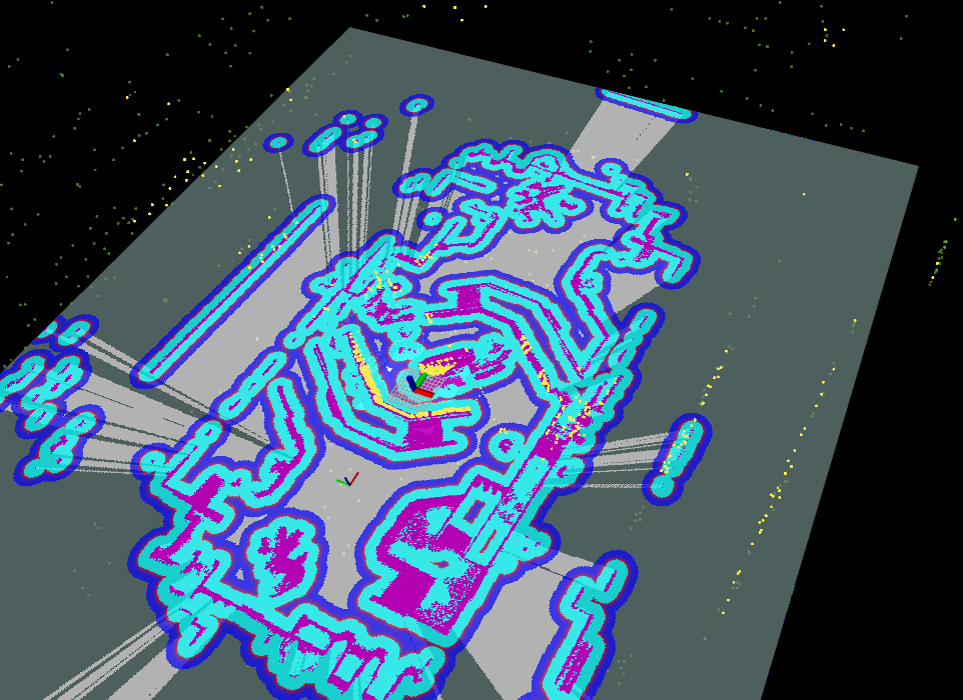

# **sp_nav**
This repository is the navigation code repository for the 2023 season's autonomous sentry.

**Contributors**
[Wei Li](https://github.com/ailiwei17),[Heming Chen](https://github.com/chmwt)

## 1. Prerequisites
###  1.1 **ROS**
ROS    >= Melodic. [ROS Installation](http://wiki.ros.org/ROS/Installation)

对于 **Ubuntu 18.04 或者更高版本的Ubuntu**, **默认**的PCL和Eigen库已经足够本仓库正常工作

### 1.2. **livox_ros_driver**
进行 [livox_ros_driver Installation](https://github.com/Livox-SDK/livox_ros_driver).

*Remarks:*

本仓库的大多数依赖(navigation/octomap/ros_numpy)为ros功能包，直接通过apt-get安装预编译版本(*Warining*:ros-noetic的ros_numpy不支持自瞄的python>3.10，请记得给自瞄配置conda环境）

按1.2，livox_ros_driver会放置在另一工作空间ws_livox，编译本仓库(通常在catkin_ws下)前记得source

在编译完本仓库后，请进行[livox_ros_driver2 Installation](https://github.com/Livox-SDK/livox_ros_driver2).livox_ros_driver2与livox_ros_driver消息类型可以共用，此处安装livox_ros_driver用于编译本仓库，livox_ros_driver2用于驱动哨兵的硬件Livox Mid 360.

运行relocalization相关功能需要
`pip install open3d==0.10.0.0 `

## 2. Build
```
    cd ~/$A_ROS_DIR$/src
    git clone https://github.com/ailiwei17/sp_nav
    cd ../..
    catkin_make
    source devel/setup.bash
```

- 如果出现消息类型头文件找不到的情况(如robot_msg/RobotStateMsg.h)，请多编译几次，原因是此处链接的文件还没有编译，等编译好后下次就能够链接到。如果还不行，使用`catkin_make -j1`进行单线程或`catkin_make -DCATKIN_WHITELIST_PACKAGES=“robot_msg”`单独编译消息包

## 3.Directly run
## 3.1 文件结构
.  
├── aerial_navigation：机器人状态功能包以及云台手通信  
├── FAST_LIO：建图以及重定位功能包  
├── robot_msg: 消息格式功能包  
├── sentry_communicator：USB2CAN通信功能包,用于运动控制  
├── sp_planning：路径规划功能包  
├── sp_decision：哨兵决策包  
└── sim_referee_sysytem：一个模拟裁判系统通讯的包，该包功能会同步到aerial_navigation或者sentry_communicator


## 3.2 run
参考FAST_LIO功能包下的操作说明.md

运行出此效果后，再继续验证与裁判系统的通信
<div align="center">
    
</div>

## 3.3 2023赛季Rosbag
[哨兵建图10分钟Rosbag](https://tj-superpower.feishu.cn/file/L1oybir3dogzCBx3pPfc247tnWc)
